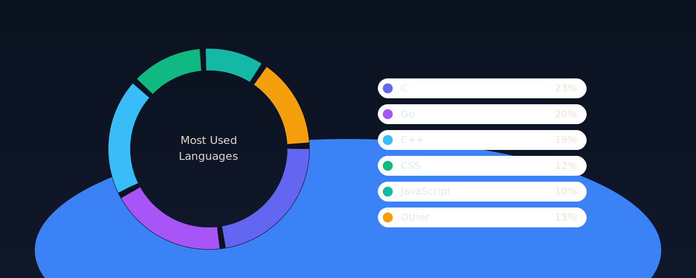

<p align="center">
  
</p>


<p align="center">
  <a href="https://t.me/whiterage88"></a>
</p>

<p align="center">
  
  
</p>

<!-- About Me Section -->


<h2 align="center">
   About Me
</h2>


```go
package main

import "fmt"

type SoftwareEngineer struct {
    Name     string
    Age      int
    Location string
    Role     string
}

func NewSoftwareEngineer() *SoftwareEngineer {
    return &SoftwareEngineer{
        Name:     "Zakhar",
        Age:      23,
        Location: "Moscow, Russia",
        Role:     "Backend Developer - road to Fullstack dev",
    }
}

func (se *SoftwareEngineer) Skills() map[string][]string {
    return map[string][]string{
        "languages":        {"Python", "Go", "C++", "JS"},
        "frameworks":       {"FastAPI", "Django", "Flask"},
        "databases":        {"PostgreSQL", "Redis", "SQLite"},
        "devops":           {"Docker", "Kafka", "Nginx", "Linux"},
        "currently_learning": {"Kubernetes", "gRPC"},
    }
}

func (se *SoftwareEngineer) SayHi() {
    fmt.Println("Thanks for dropping by! Let's build something amazing together!")
}

func main() {
    me := NewSoftwareEngineer()
    me.SayHi()
}
```

<br clear="both"/>

<h2 align="center">
   Tech Stack
</h2>

<h3 align="center">Languages</h3>
<p align="center">
  
  
  
  
</p>

<h3 align="center">Backend & Frameworks</h3>
<p align="center">
  
  
  
  
</p>

<h3 align="center">Databases</h3>
<p align="center">
  
  
  
</p>

<h3 align="center">DevOps & Cloud</h3>
<p align="center">
  
  
  
  
</p>


<!-- Language Analytics Section -->


<h2 align="center">
   Language Analytics
</h2>

<p align="center">
  
</p>

<!-- Activity Graph Section -->


<h2 align="center">
   Contribution Graph
</h2>

<p align="center">
  
</p>

<!-- Snake Animation -->
<p align="center">
  <picture>
    <source media="(prefers-color-scheme: dark)" srcset="https://raw.githubusercontent.com/whiterage/whiterage/output/github-snake-animation.svg">
    <source media="(prefers-color-scheme: light)" srcset="https://raw.githubusercontent.com/whiterage/whiterage/output/github-snake-animation.svg">
    
  </picture>
</p>


<p align="center">
  
</p>

<p align="center">
  <a href="https://github.com/n1x9s">
    
  </a>
</p>


