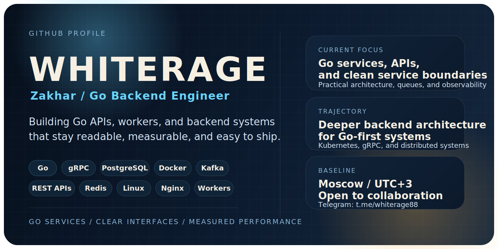
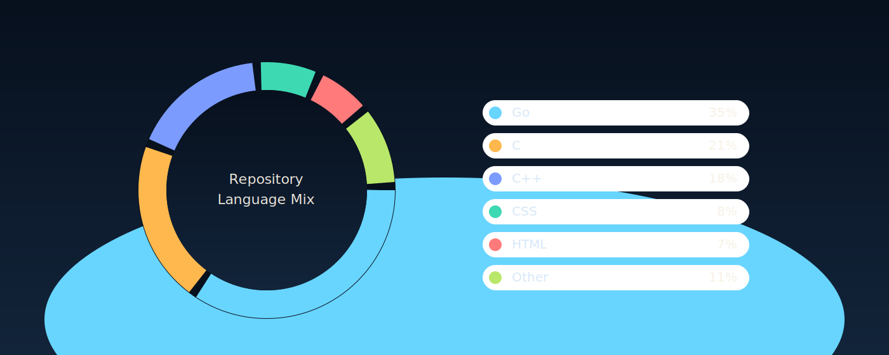

<p align="center">
  
</p>

<p align="center">
  Go backend engineer building APIs, async services, and maintainable systems with <strong>Go</strong>.
</p>

<p align="center">
  <a href="https://t.me/nepravilno88">Telegram</a>
  &nbsp;&nbsp;/&nbsp;&nbsp;
  <a href="https://github.com/whiterage?tab=repositories">Repositories</a>
  &nbsp;&nbsp;/&nbsp;&nbsp;
  <a href="https://github.com/whiterage?tab=stars">Stars</a>
</p>

## Focus

- Design Go services that stay readable after the first release.
- Build REST and gRPC APIs, workers, and integrations around real product workflows.
- Push reliability, observability, and performance where backend systems actually need it.

## Toolkit

| Area | Stack |
| --- | --- |
| Language | Go |
| Backend | REST APIs, gRPC, workers, service design |
| Data | PostgreSQL, Redis, SQLite |
| Infra | Docker, Kafka, Nginx, Linux |
| Focus Now | Kubernetes, observability, distributed systems |

## Engineering Notes

```txt
explicit APIs over clever abstractions
small services over tangled boundaries
measure latency before tuning hot paths
```

## Repository Language Mix

<p align="center">
  
</p>

<p align="center">
  If you are building Go services, infra-minded backend products, or internal platform tooling, reach out on Telegram.
</p>
