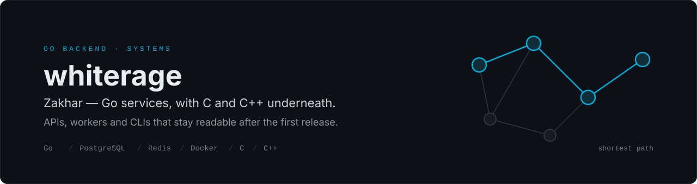

<picture>
  <source media="(prefers-color-scheme: dark)" srcset="./assets/banner-dark.svg">
  <source media="(prefers-color-scheme: light)" srcset="./assets/banner-light.svg">
  
</picture>

I write backend services in Go and came up through C and C++, so I tend to know what the
abstraction is standing on. Most of what I build is REST APIs, background workers and command-line
tools — plus a stubborn interest in implementing algorithms and data structures from scratch.

## Selected work

**Backend services**

| Project | What it is |
| --- | --- |
| [task-tracker](https://github.com/whiterage/task-tracker) | Task management API with JWT access/refresh auth, rate limiting, metrics and swappable storage backends |
| [opa-auth-service](https://github.com/whiterage/opa-auth-service) | Authorization delegated to Open Policy Agent — Keycloak-style JWT claims evaluated against embedded Rego policies |
| [geo-alert-core](https://github.com/whiterage/geo-alert-core) | Geo-alerting backend on Clean Architecture — Gin, PostgreSQL, Redis, webhook integration |
| [link-checker-service](https://github.com/whiterage/link-checker-service) | Async link checker built on a worker pool and job queue, with PDF reporting. Standard library only |
| [subscriptions-api](https://github.com/whiterage/subscriptions-api) | Subscription aggregation service — cost roll-ups over date ranges, SQL migrations, OpenAPI docs |

**Algorithms and systems**

| Project | What it is |
| --- | --- |
| [simpleNavigatorGolang](https://github.com/whiterage/simpleNavigatorGolang) | Graph algorithms written from scratch — Dijkstra, Floyd–Warshall, Prim, and three travelling-salesman solvers |
| [MazeGo](https://github.com/whiterage/MazeGo) | Maze generation and pathfinding — BFS and Q-learning solvers, cellular-automata caves, desktop and web frontends |
| [3DVIEWER](https://github.com/whiterage/3DVIEWER) | Wireframe 3D model viewer in C++20 and Qt — STL and OBJ parsing, affine transforms, GIF recording |
| [CPP_STL_Containers](https://github.com/whiterage/CPP_STL_Containers) | STL containers reimplemented in C++20 on RAII, templates and move semantics |

## Stack

| Area | Tools |
| --- | --- |
| **Languages** | Go, C, C++20 |
| **Storage** | PostgreSQL, Redis, SQLite |
| **Tooling** | Docker, Linux, Make, Git |
| **Testing** | `go test`, GoogleTest |
| **Learning now** | Distributed systems, observability, Kubernetes |

## How I work

```txt
explicit APIs over clever abstractions
small boundaries over tangled ones
measure the hot path before tuning it
```

## Contact

[Telegram](https://t.me/nepravilno88) · [Repositories](https://github.com/whiterage?tab=repositories)
